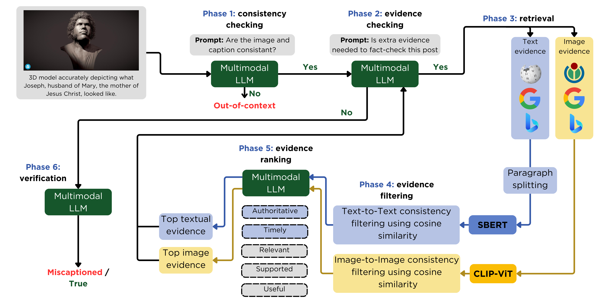

# MultiReflect

This is the code repository for the paper "MultiReflect: Multimodal Self-Reflective RAG-based Automated Fact-Checking". 

We introduce MultiReflect, a novel multimodal self-reflective Retrieval Augmented Generation (RAG)-based automated fact-checking pipeline.MultiReflect is designed to address the challenges of rapidly outdated information, limitations in human query capabilities, and expert knowledge barriers in fact-checking. Our proposed pipeline leverages the latest advancements in Large Language Models (LLMs) and Retrieval Augmented Generation (RAG) to enhance fact verification across text and images. Specifically, by integrating multimodal data processing with RAG-based evidence reflection, our system improves the accuracy of fact-checking by utilizing internet-sourced verification. A high level overview of the MultiReflect pipeline can be seen in the following figure: <br> <br> 

**Note:** As of June 2024 GPT-4V is deprecated and as an alternative GPT-4o has been implemented as the main model. The example in this repository is given using GPT-4V.

## Features

- **Consistency Checks**: To ensure consistency across image and text. Phase 1 on figure.
- **Retrieval**: Efficient and dynamic retrieval of both text and image data evidences.  Phases 2-3 on figure.
- **Filtering**: Filtering mechanisms for text and images evidences.  Phase 4 on figure.
- **Ranking**: Multi-faceted ranking algorithms for evidences based on relevance, freshness, support, and more.  Phase 5 on figure.
- **Verification**: Robust verification processes, with or without evidences.  Phase 6 on figure.

## Directory Structure

```
MultiReflect/
├── main.py                      # Entry point of the project
├── no_retrieval.py              # Alternative execution without retrieval
├── utils.py                     # Utility functions
├── verite_prep.py               # Verite dataset preparation script
├── requirements.txt             # The python package requirements of the project
├── consistency/
│   └── gpt4_consistency.py      # Ensures consistency using GPT-4
├── eval_check/
│   └── gpt4_evalcheck.py        # Evaluation check using GPT-4
├── filtering/
│   ├── filtering_image.py       # Image filtering operations
│   └── filtering_text.py        # Text filtering operations
├── ranking/
│   ├── authoritative.py         # Ranking based on authority
│   ├── combined.py              # Combined ranking logic
│   ├── freshness.py             # Ranking based on freshness
│   ├── relevance.py             # Relevance-based ranking
│   ├── support.py               # Support-based ranking
│   ├── useful.py                # Utility-based ranking
│   └── annotated_sources_final.csv  # Annotated sources data
├── retrieval/
│   ├── image_retrieval.py       # Image retrieval operations
│   └── text_retrieval.py        # Text retrieval operations
├── verification/
│   ├── verify.py                # Verification with evidence
│   └── verify_noevi.py          # Verification without evidence
├── Demo example/                # Example output of pipeline
└── .gitignore                   # Git ignore rules
```

## Installation

1. Clone the repository:
   ```bash
   git clone https://github.com/yourusername/MultiReflect.git
   ```
2. Navigate to the project directory:
   ```bash
   cd MultiReflect
   ```
3. Install the requirements:
   ```bash
   pip install -r requirements.txt
   ```

4. Install Spacy model en_core_web_sm:
   ```bash
   python -m spacy download en_core_web_sm
   ```

## Getting VERITE dataset

In our paper, we applied this model for the [VERITE dataset](https://github.com/stevejpapad/image-text-verification). The following is a short tutorial on how to set up VERITE on your MultiReflect project.

1. Create a directory for VERITE:
   ```bash
   mkdir -p data/VERITE
   ```

2. Move the verite_prep.py into data directory.:
   ```bash
   mv verite_prep.py data/
   ```

3. Navigate to data directory:
   ```bash
   cd data
   ```

4. Download the prepare_datasets.py file from VERITE github repo:
   ```bash
   curl -L -o "prepare_datasets.py" "https://raw.githubusercontent.com/stevejpapad/image-text-verification/refs/heads/master/prepare_datasets.py"
   ```

5. Navigate to VERITE directory:
   ```bash
   cd VERITE
   ```

6. Download the verite_articles.csv file from VERITE github repo:
   ```bash
   curl -L -o "VERITE_articles.csv" "https://raw.githubusercontent.com/stevejpapad/image-text-verification/refs/heads/master/VERITE/VERITE_articles.csv"
   ```
   
7. Navigate back to data directory:
   ```bash
   cd ..
   ```

8. Modify the prepare_datasets.py file by removing unrequired dependencies:
   ```bash
   sed -i.bak '17d' prepare_datasets.py
   ```

9. Run verite_prep.py. This will prepare the VERITE dataset by downloading required images
   ```bash
   python verite_prep.py
   ```

10. Rename VERITE directory to original:
   ```bash
   mv VERITE original
   ```

11. Navigate back to main directory:
   ```bash
   cd ..
   ```

## Usage

### Setting up the API keys

To run the full pipeline, you need to create several API keys:

1. Get the [Google Cloud API](https://cloud.google.com/apis?hl=en) key.
2. Create a [JSON service account key for Google Vision](https://stackoverflow.com/questions/46287267/how-can-i-get-the-file-service-account-json-for-google-translate-api). Add that JSON file to the MultiReflect folder.
3. Get [Bing API](https://www.microsoft.com/en-us/bing/apis/bing-web-search-api) key.
4. Get [Wikimedia API](https://api.wikimedia.org/wiki/Main_Page) app name, email and key.

### Running the Main Script
To execute the primary functionality, run with your corresponding keys from the previous step:

<!--

python main.py --bingkey "YOUR_BING_API_KEY" --wikimediaappname "YOUR_WIKIMEDIA_APP_NAME" --wikimediaemail "YOUR_WIKIMEDIA_EMAIL" --wikimediakey "YOUR_WIKIMEDIA_KEY" --serviceskeypath "PATH_TO_YOUR_GOOGLE_SERVICE_KEY" --googlekey "YOUR_GOOGLE_API_KEY" --openaikey "YOUR_OPENAI_KEY"
-->

```bash
python main.py \
  --bingkey "YOUR_BING_API_KEY" \
  --wikimediaappname "YOUR_WIKIMEDIA_APP_NAME" \
  --wikimediaemail "YOUR_WIKIMEDIA_EMAIL" \
  --wikimediakey "YOUR_WIKIMEDIA_KEY" \
  --serviceskeypath "PATH_TO_YOUR_GOOGLE_SERVICE_KEY" \
  --googlekey "YOUR_GOOGLE_API_KEY" \
  --openaikey "YOUR_OPENAI_KEY"
``` 

After running main.py, you will see the printed progress of each datapoint in your dataset
```
Checking Consistency for Sample 1
Consistency Verdict: 1
Consistency Score: 0.9
--------------------------------------------------
Checking if Retrieval is Needed for Sample 1
First Eval Check: True
--------------------------------------------------
Retrieval Needed for Sample 1
Retrieval Done for Sample 1
--------------------------------------------------
Filtering Text for Sample 1
Text Filtering Done for Sample 1
--------------------------------------------------
Filtering Image for Sample 1
Image Filtering Done for Sample 1
--------------------------------------------------
Ranking Text and Image for Sample 1
Ranking Done for Sample 1
--------------------------------------------------
Checking for each Evidence for Sample 1
Checking for each Evidence Done for Sample 1
--------------------------------------------------
Verifying for Sample 1
Verification Done for Sample 1
--------------------------------------------------
--------------------------------------------------
```

### Example pipeline responses:
The pipeline also saves the consistency and verification responses. The following is the first example from the VERITE dataset run using GPT-4V. All of the outputs and retrieved evidences for this datapoint are given in the folder [example demo](https://anonymous.4open.science/r/MultiReflect/demo%20example/demo_README.md) (please refresh the page if the demo_readme.md file does not open or open it manually)

**IMAGE:**


**CAPTION:** 

Photograph shows a family that was taken away by local epidemic prevention personnel after they had returned home from Hubei Province in February 2020 while they were asked to self-quarantine in their homes for 14 days.

**LABEL:** 

TRUE

**consistency response**

```json
{"consistency_response": "<verdict>TRUE</verdict>\n<score>0.8</score>\n\nThe image shows individuals in protective gear, which could be associated with epidemic prevention personnel. However, without the ability to verify the specific context or the authenticity of the claim, there may be some uncertainty. The score reflects this level of uncertainty."}
```

**verfication response**

```json
{"response": "[TRUE]\nConfidence Score: 0.9\n\nThe image and caption are factually correct based on the evidence provided. The evidence states that the video from which the image is taken was indeed recorded in February 2020, aligning with the timeline described in the caption. The context of the video, including the location and the actions taken by epidemic prevention personnel, is consistent with the information provided by official sources such as The Associated Press and NBC News. Therefore, the image and the caption correctly depict the events that occurred during that time. The reason for not giving a full 1.0 score is due to the nature of verifying facts from a singular event; while all reputable sources align, there's an extremely small possibility of misreporting.", "num text evidence": 1, "num image evidence": 0}
```

### Alternative Modes
- **No Retrieval Mode**: This mode will run the pipeline without phases 2-5, thus only checking for consistency and running verification directly after.
  ```bash
  python no_retrieval.py --openaikey "YOUR_OPENAI_KEY"
  ```

### Module-Specific Execution
Run specific modules as needed. Some scripts might need to be modified depending on your input format, so we recommend loading in the functions from those scripts and adapting them where needed.
- Consistency Check:
  ```bash
  python consistency/gpt4_consistency.py
  ```
- Image Filtering:
  ```bash
  python filtering/filtering_image.py
  ```
- Text Retrieval:
  ```bash
  python retrieval/text_retrieval.py
  ```
---
